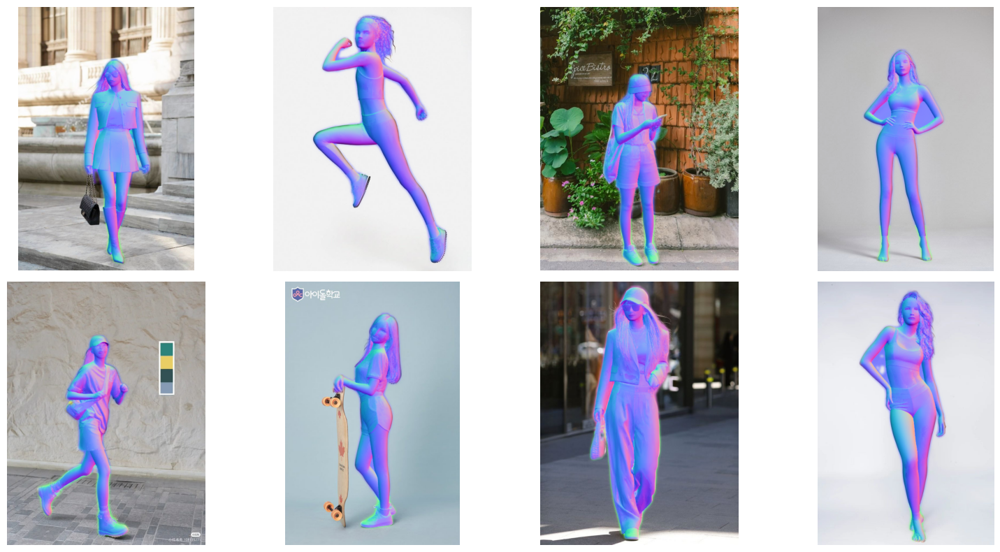
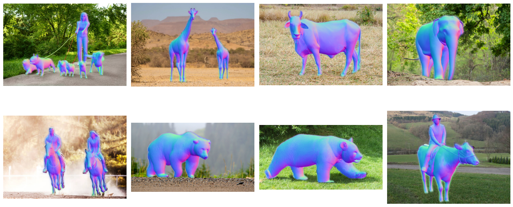

    <h1>Surface Normals Estimation using Marigold   with PointRend in PixelLib </h1>

  

---

## 🏗️ Methodology

- 🗿🗿 Surface Normals Estimation Model: **prs-eth/marigold-normals-v1-1**
- 🗿🗿 Framework: **PyTorch + Hugging Face**
- 🧍🏻🧍🏻‍♀️ Instance Segmentation Model: **pointrend_resnet50.pkl**
- 🦣🐎 Framework: **PyTorch + PixelLib**

---

## ⭐ Acknowledgements

- Marigold powered by `Hugging Face`
- PointRend powered by `PixelLib`

---
